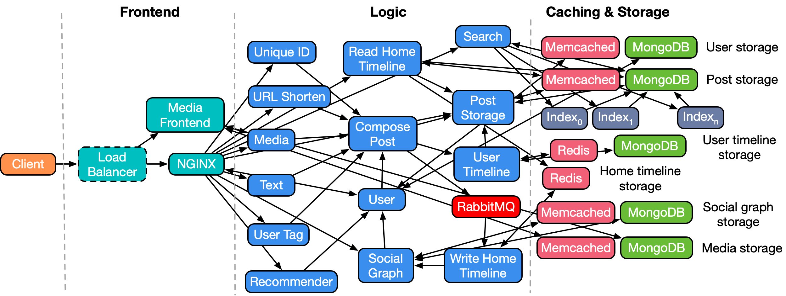

# Social Network Microservices

A social network with unidirectional follow relationships, implemented with loosely-coupled microservices, communicating with each other via Thrift RPCs. 

## Application Structure



Supported actions: 
* Create text post (optional media: image, video, shortened URL, user tag)
* Read post
* Read entire user timeline
* Receive recommendations on which users to follow
* Search database for user or post
* Register/Login using user credentials
* Follow/Unfollow user

## Preqreqs

#### Environmental checklist🧾

| Configuration item | Specific configuration |
| :----------------: | :--------------------: |
|         OS         |        centos7         |
|     Kubernetes     |         v1.18+         |

Have Installed the nfs-client-provisioner,it will create the pv and pvc we need.

```shell
kubectl apply -f $(pwd)/deploy/storageclass/.
```


## Steps to install SocialNetwork

```shell
sh $(pwd)/deploy/deployDataNode.sh
sh $(pwd)/deploy/deployCompute.sh
```


## Steps to uninstall SocialNetwork

```shell
sh $(pwd)/deploy/undeploy.sh
```


## To test SocialNetwork

```shell
USERS=1 EXP_TIME=80s docker-compose -f $(pwd)/locust/docker-compose.yml up --scale worker=1
```

PS: In docker-compose.yml:
   1)、--host http://172.16.84.129:5000     The IP Address need to be changed
   2)、\- $HOME/sinan_locust_log:/mnt/locust_log     $HOME/sinan_locust_log,the directory must exist,you can decide to store where


## Running the social network application
### Before you start
- Install Docker and Docker Compose.
- Make sure the following ports are available: port `8080` for Nginx frontend, `8081` for media frontend and 
  `16686` for Jaeger.

### Start docker containers
Start docker containers by running `docker-compose up -d`. All images will be 
pulled from Docker Hub.

### Register users and construct social graphs
Register users and construct social graph by running 
`python3 scripts/init_social_graphs.py`. This will initialize a social graph 
based on [Reed98 Facebook Networks](http://networkrepository.com/socfb-Reed98.php),
with 962 users and 18.8K social graph edges.

### Running HTTP workload generator
#### Make
```bash
cd wrk2
make
```

#### Compose posts
```bash
cd wrk2
./wrk -D exp -t <num-threads> -c <num-conns> -d <duration> -L -s ./scripts/social-network/compose-post.lua http://localhost:8080/wrk2-api/post/compose -R <reqs-per-sec>
```

#### Read home timelines
```bash
cd wrk2
./wrk -D exp -t <num-threads> -c <num-conns> -d <duration> -L -s ./scripts/social-network/read-home-timeline.lua http://localhost:8080/wrk2-api/home-timeline/read -R <reqs-per-sec>
```

#### Read user timelines
```bash
cd wrk2
./wrk -D exp -t <num-threads> -c <num-conns> -d <duration> -L -s ./scripts/social-network/read-user-timeline.lua http://localhost:8080/wrk2-api/user-timeline/read -R <reqs-per-sec>
```

#### View Jaeger traces
View Jaeger traces by accessing `http://localhost:16686`

Example of a Jaeger trace for a compose post request: 


### Development Status

This application is still actively being developed, so keep an eye on the repo to stay up-to-date with recent changes. 

#### Planned updates

* Front-end design
* Upgraded recommender
* Upgraded search engine 

 

